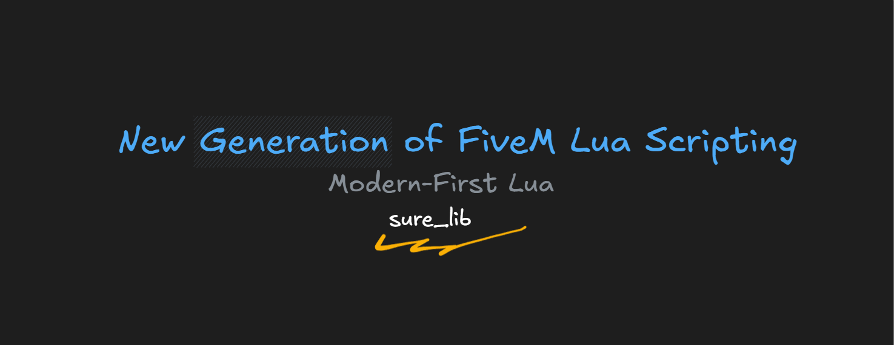

# 999s Documentation

A modern documentation website for 999s scripting resources, built with Mintlify.



## Overview

999s Documentation is a comprehensive guide for scripting resources that help developers write better, more maintainable code. The documentation focuses on providing clear, easy-to-understand guides for various scripting tools and utilities, with a particular emphasis on the 999s Bridge framework.

## Features

- 📚 Modern documentation with a clean, intuitive interface
- 🎨 Custom theme with beautiful color scheme
- 🔧 Comprehensive API references
- 📱 Responsive design for all devices
- 🌐 Multi-language support (English and Thai)

## Project Structure

```
docs.json           # Mintlify configuration
favicon.png         # Site favicon
index.mdx          # Home page
style.css          # Custom styles
images/            # Image assets
logo/              # Logo assets
scripts/           # Documentation content
└── 999s-bridge/   # Bridge framework documentation
    ├── getting-started.mdx
    ├── schema-manager.mdx
    ├── event-manager.mdx
    ├── debug.mdx
    ├── state.mdx
    └── array.mdx
```

## Documentation Content

The documentation covers several key areas:

- **Getting Started Guide**: Basic setup and requirements
- **999s Bridge Framework**:
  - Schema Management
  - Event System
  - Debug Tools
  - State Management
  - Array Utilities

## Development

This documentation site is built using [Mintlify](https://mintlify.com/), a modern documentation platform.

### Requirements

- Node.js
- Mintlify CLI

### Local Development

1. Install Mintlify CLI:
```bash
npm install -g mintlify
```

2. Start the development server:
```bash
mintlify dev
```

3. Preview the documentation at `http://localhost:3000`

## Support

For support inquiries, please contact: [fx.frame009@gmail.com](mailto:fx.frame009@gmail.com)

## Links

- [Documentation](https://999s.mintlify.app/)
- [Portfolio](https://stateless-prt.vercel.app)
- [GitHub](https://github.com/mysbryce)

## License

All my resources (non open-source) are protected by DMCA. All rights reserved.

